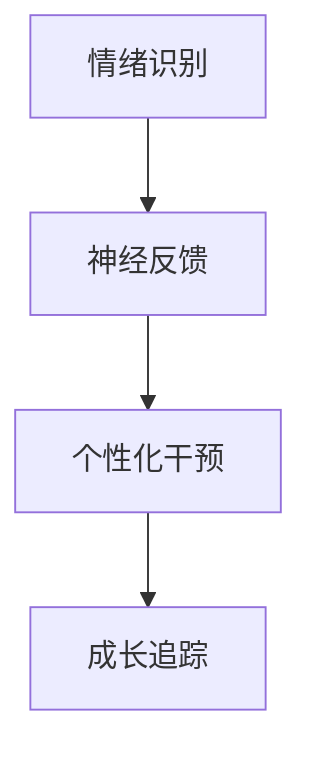

```markdown
# 人工智能时代教师核心素养发展白皮书
## （基于A4尺寸排版规范）

### 一、核心素养框架
**1. 智能教育素养**  
  
- 教育AI系统开发能力
- 算法伦理治理能力
- 人机协同教学设计

**2. 人本关怀素养**  


### 二、国际比较分析
| 国家       | 特色项目                  | 技术应用                  |
|------------|--------------------------|-------------------------|
| 中国       | "人工智能+教师"行动计划   | 课堂行为大数据分析        |
| 芬兰       | AI教师认证体系           | 虚拟现实教学平台          |
| 新加坡     | 教师数字孪生计划          | 智能备课系统              |

### 三、发展路径建议
1. **技术融合路径**  
   - 年度AI工具掌握清单：
     ```2023
     Q1: ChatGPT教育应用
     Q2: Midjourney课件设计
     Q3: Python教育数据分析
     ```

2. **素养发展矩阵**  
   | 阶段   | 目标                      | 评估指标               |
   |--------|--------------------------|----------------------|
   | 初级   | 基础工具应用              | 完成5个AI教学案例     |
   | 中级   | 跨学科整合                | 开发3个STEAM课程     |
   | 高级   | 教育生态系统构建          | 建立智能教研共同体    |

### 四、实施工具推荐
- **备课工具**  
  ```json
  {
    "智能设计": "Canva教育版",
    "学情分析": "ClassDojo",
    "课件生成": "SlidesAI"
  }
  ```

### 五、参考文献
1. OECD《教育2030》  
2. 中国《教育信息化2.0行动计划》  
3. ISTE教育技术标准（2022）

<footer style="font-size:10pt;color:#666;">
注：本文件建议使用A4（210×297mm）纸张打印，正文采用小四号宋体，行距1.5倍
</footer>